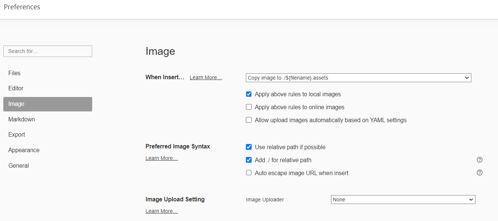
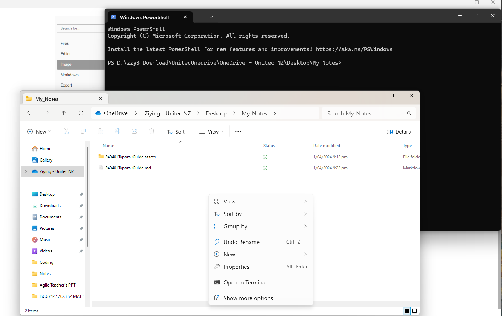

# Typora Guide

### Insert an image with relative path

*Typora>>File>>Preferences>>image*




> #### Upload your notes to GitHub

1. Create a new repository called `My_Notes` .

2. Open terminal from the location of  your local "My_Notes" file folder:

   

   

3. Enter the following on the command line in that terminal:

```
git init
git add .
git commit -m "first commit"
git branch -M main
git remote add origin https://github.com/Zoe6486/My_Notes.git
git push -u origin main
```

 Then the folder will be uploaded to GitHub successfully.

> #### Update your notes on GitHub

1. Open terminal from the location of  your local "My_Notes" file folder.
2. Enter the following on the command line in that terminal:

```
git add .
git commit -m "xxxxxx"
git push
```

 Then the folder will be updated to GitHub successfully.

